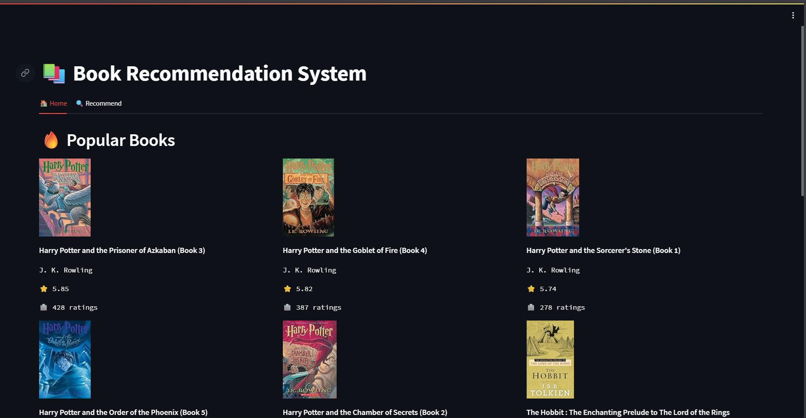

<h1 align='center'>📚 Book Recommendation System</h1>

A <strong>content-based book recommender system</strong> built using
<strong>Python, Pandas, Scikit-Learn, and Streamlit</strong>.
This application suggests similar books based on user input using
<strong>cosine similarity</strong>.

    Python
    Streamlit
    Machine Learning
    Recommendation System

<h2>📌 Features</h2>
<ul>
    <li>📖 Displays top popular books based on ratings</li>
    <li>🔍 Accepts partial book names (e.g. <code>harry potter</code>)</li>
    <li>🤝 Recommends top 5 similar books using cosine similarity</li>
    <li>🖼️ Shows book cover, title, and author</li>
    <li>⚡ Fast response using precomputed similarity matrix</li>
</ul>

<h2>🧠 How It Works</h2>
<ul>
    <li>User-book rating matrix is created</li>
    <li>Cosine similarity is computed between books</li>
    <li>Top similar books are retrieved for recommendations</li>
    <li>Partial text matching improves search experience</li>
</ul>

<h2>🗂️ Project Structure</h2>
<pre>
Book-Recommender/
│
├── streamlit_app.py        # Streamlit application
├── books.pkl               # Book metadata
├── popular.pkl             # Popular books dataframe
├── pt.pkl                  # Pivot table (user-book matrix)
├── similarity_scores.pkl   # Cosine similarity matrix
├── requirements.txt        # Dependencies
└── README.html             # Project documentation
</pre>

<h2>📦 Installation & Run Locally</h2>

<h3>1️⃣ Clone Repository</h3>
<pre>
git clone https://github.com/your-username/Book-Recommender.git
cd Book-Recommender
</pre>

<h3>2️⃣ Install Dependencies</h3>
<pre>
pip install -r requirements.txt
</pre>

<h3>3️⃣ Run Streamlit App</h3>
<pre>
streamlit run streamlit_app.py
</pre>

<h2>🛠️ Tech Stack</h2>
<ul>
    <li>Python</li>
    <li>Streamlit</li>
    <li>Pandas & NumPy</li>
    <li>Scikit-Learn</li>
    <li>Cosine Similarity</li>
</ul>

<h2>📈 Future Improvements</h2>
<ul>
    <li>Search autocomplete dropdown</li>
    <li>Hybrid (content + collaborative) recommendation</li>
    <li>User login & personalized history</li>
    <li>Author-based recommendations</li>
</ul>

<h2>📷 Dashboard Preview</h2>

  

  <i>Example interface of the Streamlit-based Books Recommender.</i>

<h2>👤 Author</h2>

<strong>Arvinth Athikesav</strong> 
💼 LinkedIn: <em>ArvinthAthiKesav</em> 
🐙 GitHub: <em>arvinth186</em>

⭐ If you like this project, don’t forget to star the repository!

</body>
</html>
